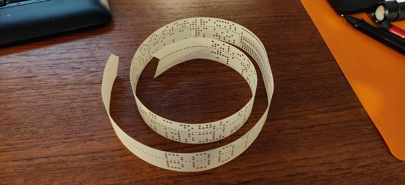

# Paper tape resources

# documents
[documents](./documents)

## pdp8 Blinkenlights
[Blinky](./BLINKY8_V1.zip)

## pdp8 tape loading
[https://oldfellowstoys.net/2016/06/03/blinkenlights/](https://oldfellowstoys.net/2016/06/03/blinkenlights/)

## pdp8 verbum
[verbum.pal](./verbum.pal)

## pdp11 tape loading
[http://www.technology.niagarac.on.ca/people/mcsele/hobby/vintage-digital-pdp-11-computers/](http://www.technology.niagarac.on.ca/people/mcsele/hobby/vintage-digital-pdp-11-computers/)

## verbum for windows
[https://github.com/wcwuttke/Verbum](https://github.com/wcwuttke/Verbum)

## absolute loader tape file
[DEC-11-L2PC-PO.ptap](./verbum/DEC-11-L2PC-PO.ptap)

## verbum for linux
[verbum](./verbum)

## pdp11 tape loading
[https://bigdanzblog.wordpress.com/2014/06/17/simh-pdp-8-manually-loading-the-rim-loader-the-binary-loader-and-an-application-from-paper-tape/](https://bigdanzblog.wordpress.com/2014/06/17/simh-pdp-8-manually-loading-the-rim-loader-the-binary-loader-and-an-application-from-paper-tape/)

## Arduino OP80a tape reader
[OP80a-PaperTape-OLED](./OP80a-PaperTape-OLED)

